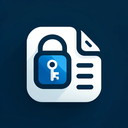

# About Secure Text

Secure Text is a chrome web extension which can help you to encrypt the text that you will provide with the password and then that encrypted text can be shared to the other person can then password can be shared over phone call ,which will ensure that only original person will read the text after decryption.

### Encryption Algorithum Supported

##### 1.AES-GCM :
 AES-GCM stands for Advanced Encryption Standard - Galois/Counter Mode. It is a symmetric encryption algorithm that combines the AES block cipher with GCM for both encryption and authentication, ensuring data confidentiality and integrity.
 
##### 2.AES-CBC :
AES-CBC (Advanced Encryption Standard-Cipher Block Chaining) is a symmetric encryption algorithm that encrypts data in fixed-size blocks using a cipher key and an initialization vector (IV) for added security. In CBC mode, each block of plaintext is XORed with the previous ciphertext block before being encrypted, ensuring that identical plaintext blocks produce different ciphertext blocks.

### Encoding Algorithm Supported

##### 1.BASE-64 :
Base64 is an encoding scheme that converts binary data into an ASCII string format. This is done to ensure the data remains intact without modification during transport. It uses a specific 64-character alphabet.

##### 1.BASE-32 :
Base64 is an encoding scheme that converts binary data into an ASCII string format. This is done to ensure the data remains intact without modification during transport. It uses a specific 64-character alphabet.

### Extension Link

|  |  |
|:------------------------------------------:|:------------------------------------------:|

[Click here to check our extension...](https://chrome.google.com/webstore/detail/ankgchfieiimiijhlcjcongijapefmei)
